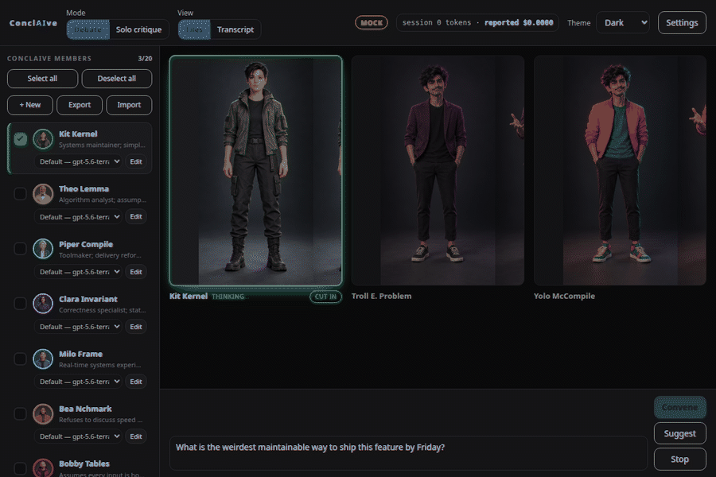

# ConclAIve

## Summary

ConclAIve is a Tauri desktop app that convenes fictional specialist agents to critique an idea, review a codebase, or debate a decision. Each member has a distinct voice, expertise, interruption style, and three-state animated portrait: stoic, talking, and angry.



The frontend is vanilla HTML, CSS, and JavaScript in `dist/`. Structural CSS is split into focused modules under `dist/css/`, while every theme is a standalone token file under `dist/css/themes/`. JavaScript is separated by responsibility, including the harness bridge, persona store, debate engine, prompt builder, and views. The Rust shell in `src-tauri/` runs the selected local AI harness for each member and preserves a separate conversation session for every persona. There is no frontend build step.

## Requirements

- Rust stable with Cargo
- Tauri CLI v2 (`cargo install tauri-cli --version "^2.0" --locked`)
- The platform prerequisites for Tauri v2, including its system webview
- At least one supported AI harness, installed and signed in:
  - Codex CLI, available as `codex`
  - OpenCode, available as `opencode`
  - Claude Code, available as `claude`
- Node.js for the deterministic test suite

## Build

```bash
cd src-tauri
cargo tauri build
```

For a development build with hot reload:

```bash
cd src-tauri
cargo tauri dev
```

## Short guide

1. Open **Settings**, choose Codex, OpenCode, or Claude Code, and enter a model id understood by that CLI.
2. Enter a question or decision in the prompt box.
3. Use **Suggest** or select council members manually.
4. Choose **Debate** for a shared argument or **Solo critique** for independent reviews.
5. Optionally set a codebase directory in Settings for read-only file analysis.
6. Click **Convene**, then switch between **Tiles** and **Transcript** as the discussion runs.
7. Click a member to choose that persona's harness and corresponding model, or customize their voice, color, and portrait.

To preview the interface without invoking an AI harness, serve `dist/` with any static server and open `index.html?mock=1`.

Run the deterministic tests with:

```bash
node test/dynamics.test.js
node test/matching.test.js
node test/harness.test.js
```

## Future

- [ ] Add portrait preloading and compressed production formats
- [ ] Add user-selectable expression packs for custom personas
- [ ] Add session export and import
- [ ] Add configurable council presets
- [ ] Add end-to-end UI coverage
- [ ] Bundle signed installers for major desktop platforms

## Licensing

ConclAIve is available under the [MIT License](LICENSE).

## Contributing

Contributions from anyone are welcome. Open an issue for substantial changes, keep persona designs fictional, run all test files, and include a concise description of the behavior you changed.
